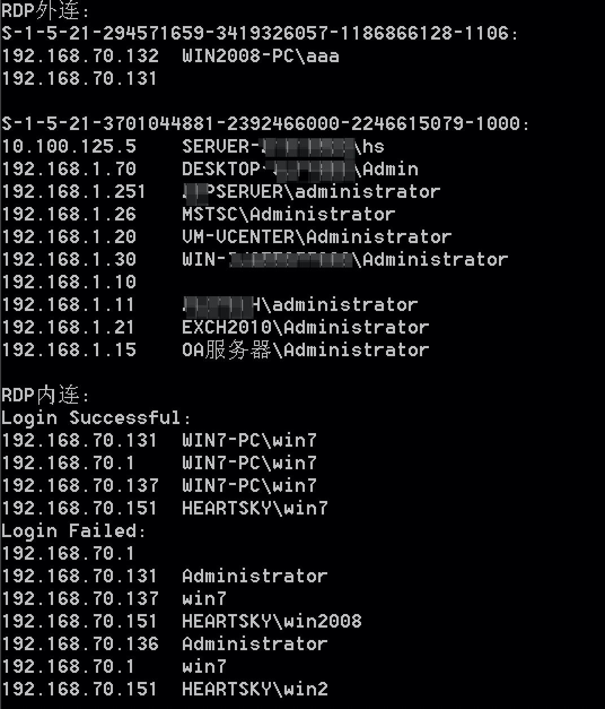

# ListRDPConnections
## 简介
C# 读取本机对外RDP连接记录和其他主机对该主机的连接记录，从而在内网渗透中获取更多可通内网网段信息以及定位运维管理人员主机

## 原理
* 对外 RDP 连接记录
    * 对外 RDP 连接记录保存在 `HKEY_USERS\[SID]\Software\Microsoft\Terminal Server Client\` 下，默认只包含缺省用户设置和已登录用户的信息
    * 未登录用户连接记录需要通过加载对应用户目录下的 `NTUSER.DAT` 到注册表中并读取来实现
    * 需要有 `SeBackupPrivilege` 和 `SeRestorePrivilege` 这两项权限才可以实现对注册表的读和写操作
* 对内 RDP 连接记录
    * 对内 RDP 连接记录保存在 Windows 事件日志中(eventvwr)，为了获取更多连接信息，不再区分是否是通过 RDP 登录
    * 一个完整的 `rdp登录->注销` 过程包括 `网络连接->身份认证->登录->注销`，在注销前还可能发生 `会话断开/重新连接`
    * 选取 `EventID: 1149 网络连接` 事件作为全量的登录事件，`EventID: 21 登录成功` 和 `EventID: 25 重新连接` 作为登录成功的事件，通过剔除登录成功的事件即为登录失败的事件

## 应用场景
*  内网渗透中获取更多可通网段信息
*  内网渗透中定位运维管理人员主机等关键主机
*  ......

## 效果
